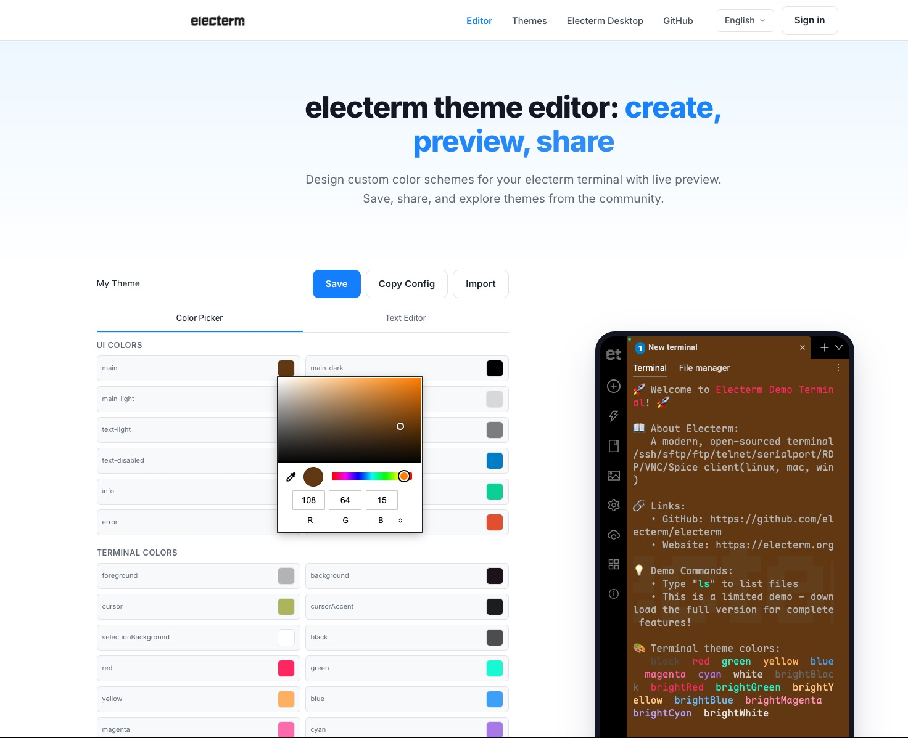

# electerm theme editor

**Create, preview, and share custom themes for [electerm](https://electerm.org) terminal.**

[English](./README.md) | [简体中文](./README_zh.md)

---

A free, browser-based theme editor for the [electerm](https://electerm.org)
terminal. Design your own color scheme with a live preview, save it to the
cloud, and share it with the community — or browse and remix themes created by
others.

## Features

- 🎨 **Visual theme editor** — color picker and text editor with a real-time
  live preview powered by the electerm demo site
- ☁️ **Cloud save & share** — sign in with GitHub to save your themes and
  publish them to the public gallery (up to 10 per account)
- 🖼️ **Theme gallery** — browse community themes with color preview cards and
  author info, sorted by newest or most liked
- ❤️ **Like, copy & share** — like themes, copy their config to your clipboard,
  edit them in the editor, or share to social media
- 🌍 **Bilingual** — English and 简体中文, with client-side language switching

## Resources

- 🌐 **Website**: <https://theme.electerm.org>
- 🖥️ **electerm Desktop**: <https://electerm.org>
- ☁️ **electerm Online**: <https://cloud.electerm.org>
- 🔎 **Live demo**: <https://demo.electerm.org>
- 💬 **GitHub Discussions**: <https://github.com/electerm/electerm/discussions>

## Related Projects

This site is part of the electerm project family:

- [electerm](https://github.com/electerm/electerm) — the terminal/SSH/SFTP/Telnet/serial client these themes are built for
- [electerm-web](https://github.com/electerm/electerm-web) — browser version of electerm
- [electerm-locales](https://github.com/electerm/electerm-locales) — translations

## Support

Found a bug or have an idea? Please
[open an issue](https://github.com/electerm/electerm/issues) or start a
[discussion](https://github.com/electerm/electerm/discussions).

## Legal

- [Privacy Policy](https://theme.electerm.org/privacy/)
- [Terms of Use](https://theme.electerm.org/terms-of-use/)

## For Developers

theme.electerm.org runs on Cloudflare Workers + D1 with a vanilla-JS,
Pug + Stylus frontend. The full technical documentation — architecture, local
development, deployment, database schema, and API reference — lives in
[**`src/docs/DEVELOPMENT.md`**](./src/docs/DEVELOPMENT.md).

## Author

**ZHAO Xudong** — [GitHub](https://github.com/zxdong262) · [Website](https://html5beta.com)

## License

MIT © [ZHAO Xudong](https://github.com/zxdong262)
